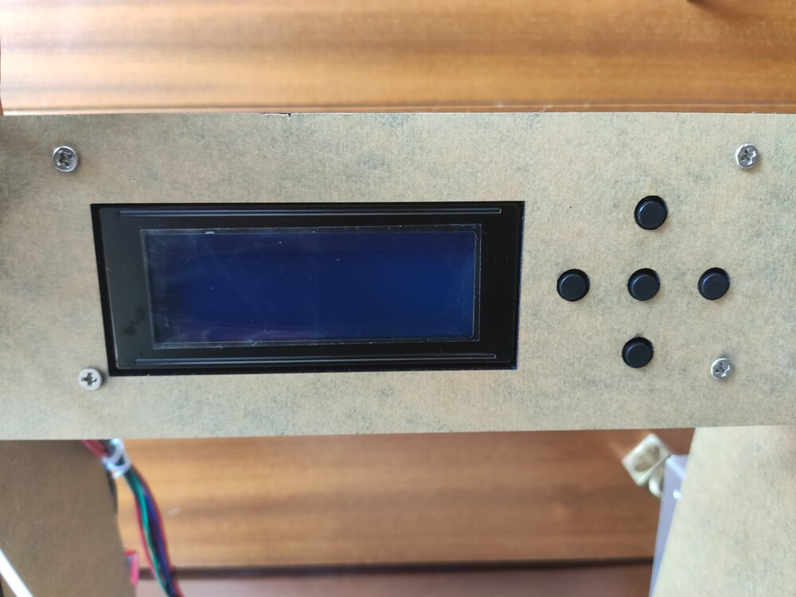
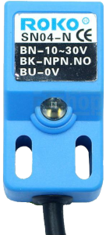
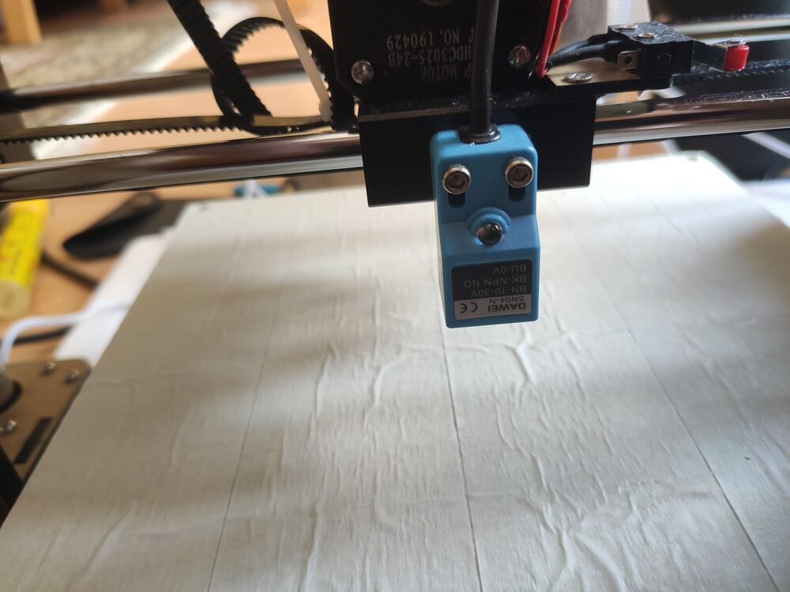
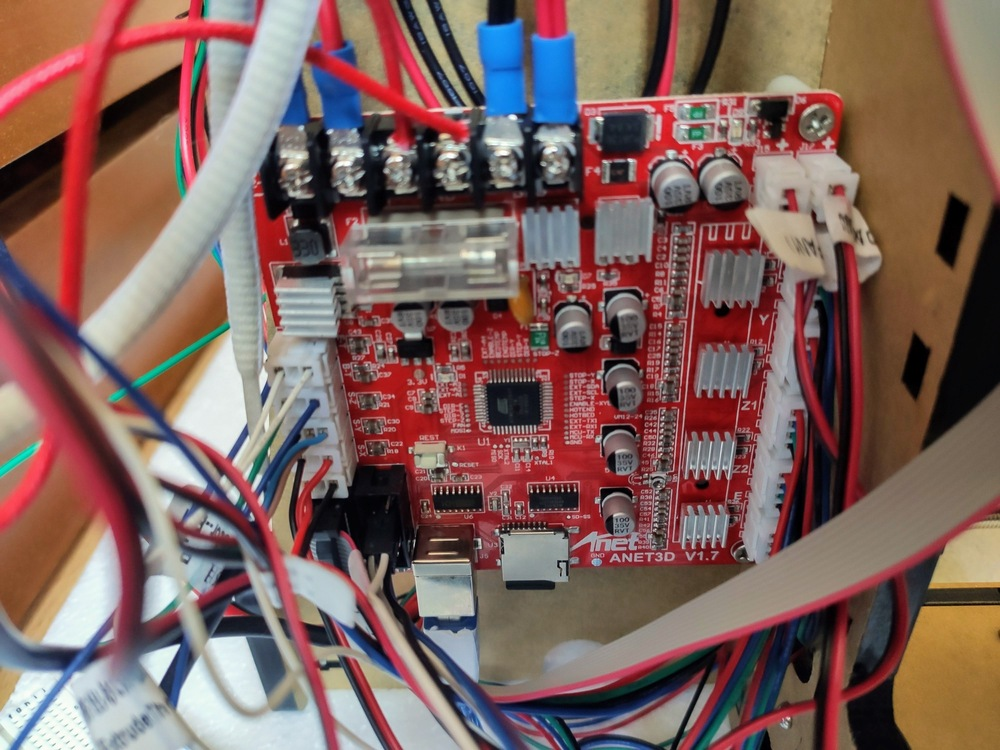
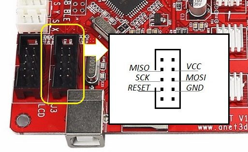

# Anet A6 with Marlin 2.0

I've recently purchased Anet A6 - a very cheap 3D printer which I paid for with my time.

Some months ago when I ordered an Anet A6 from Aliexpress.
There were some issues, but finally the seller managed to send me exactly [this model](https://www.aliexpress.com/item/32827521610.html) - Anet A6L as it's stated.

There are some differences from the regular Anet A6 which I did not realized at first sight.

Mainly this exact printer is equipped with a Star 5-button LCD (found in Anet A8) instead of the fancy rotating button with larger screen.
I think this particular printer is kind of hybrid of Anet A6 and Anet A8.
But I'm fine with that as long as it works.



I have no previous experience with 3D printers and a very very little experience with microchips (like Arduino).
However, I'm quite experienced with higher level programming and a like these kinds of challenges.

## Auto leveling

The _L_ in Anet A6L stands for _leveling_.
A _ROKO SN04-N_ sensor was included, which is an induction sensor.
Induction sensors detect metal, therefore it is not possible to print e.g. on a glass sheet.



The sensor is attached to the main board instead of the Z-stop.
Fix it just in the lowest position possible.
Later you can determine the `NOZZLE_TO_PROBE_OFFSET` following this process:
1. Set `NOZZLE_TO_PROBE_OFFSET` to `0` (the Z axis).
2. Home Z axis. Printer will say `Z=0`.
3. Move manually the Z axis as low to the bed as possible until a sheet of paper will be "pinned" with the nozzle. You may need to disable _Soft stops_ (to make the nozzle move beneath 0).
4. Take current Z value a make it negative - that is you Z `NOZZLE_TO_PROBE_OFFSET` (for example mine is `-0.25`)



## Original firmware

The first printed boxes were fine and I was quite happy. But I noticed The original firmware was insufficient at all.
Due to the presence of a fan on the left side of extruder the printer could't home X axis correctly.
As a result centering the nozzle did not actually move the nozzle to the center of heat bed but about 4 cm to right.
This means it was not possible to print full-sized (22x22 cm) objects.

Furthermore the original firmware does not support auto-leveling and is quite basic after all.

I have back the original firmware up when burning new bootloader, it is available [here](anet-a6-original.hex).

## Marlin firmware

I decided to flash better firmware.
I've found printing community somewhat recommends Marlin community.

The procedure seemed to be easy - download Marlin sources, include Anet A6 related config, compile in Arduino IDE, flash and you're ready.

Well... it was not.

### Bootloader

After some hours of ~~trial and~~ error when I was unable to flash the firmware via Arduino IDE (avrdude sync error 0x00) I've learned there should be a tiny piece of that program called bootloader, which purpose is to allow flashing firmware via USB (from e.g. Arduino IDE).
And it is very likely that since Anet v1.5 main board this bootloader is missing (to save some memory).
Since my main board says _Anet v1.7_ I was convinced my board is missing bootloader and needs to be burned first.



There are plenty of guides how to burn bootloader [using Arduino](https://www.instructables.com/id/HOW-TO-FIX-ANET-BRICKED-BOARD-USING-AN-ARDUINO-UNO/).
Unfortunately I don't own Arduino.
However, I have an ESP32 and a Raspberry.

Long story short, the key words to google are `raspberry as avr isp ` (in-system programmer).
Although I've found a guide how to turn my [ESP32 into an AVR ISP](https://github.com/lbernstone/ESP_AVRISP), I did not succeed connecting ESP32 to the printer.
I suppose it is possible, but I was missing experiences.
If you wanted to give your ESP32 a try, keep in mind that you don't want to connect power wires (ESP uses 3.5 V while Anet is on 5 V), but you want to connect the ground.

My idea was to use Raspberry as AVR programmer, connect to it via SSH and perform all operations via CLI tools.
I did it this way:

#### Connecting wires

Connect Raspberry pins with Anet J3 pins as follows:

| Anet J3 pin  | Raspberry GPIO pin |
| --------- | ----------- |
| MISO | GPIO 16 |
| SCK | GPIO 21 |
| RESET | GPIO 12 |
| MOSI | GPIO 20 |
| GND | Ground |

All the Raspberry pins are the bottom right pins.
You don't have to connect power (VCC <-> 5V power), it's enough just to power on the printer.




#### Installing Avrdude

This part is done on Raspberry.
I was using SSH connection.
Following [this guide](https://oxygene.sk/2015/02/using-raspberry-pi-as-an-arduino-avr-programmer/) you will build and install `avrdude` with linuxgpio support:
```bash
sudo apt-get install bison flex libusb-dev
cd /tmp
wget http://download.savannah.gnu.org/releases/avrdude/avrdude-6.3.tar.gz
tar xf avrdude-6.1.tar.gz
cd avrdude-6.1
./configure --prefix=/opt/avrdude --enable-linuxgpio
make
sudo make install
```

It is possible that the latest Raspbian `avrdude` already supports linuxgpio, you can give it a try.

Specify the linuxgpio programmer for avrdude somewhere at the end of `/opt/avrdude/etc/avrdude.conf`:
```
programmer
  id    = "linuxgpio";
  desc  = "Use the Linux sysfs interface to bitbang GPIO lines";
  type  = "linuxgpio";
  reset = 12;
  sck   = 21;
  mosi  = 20;
  miso  = 16;
;
```

#### Backing current firmware up

Make sure the processor on your Anet board says it's `ATMEGA 1284P`.
If not, you have to adjust all future commands.

Save your current firmware into `anet-a6-original.hex`:
```
sudo /opt/avrdude/bin/avrdude -p atmega1284p -c linuxgpio -v -U flash:r:anet-a6-original.hex:i
```


#### Burning bootloader

Following [the guide of Marlin firmware competitor Klipper](https://www.klipper3d.org/Bootloaders.html) we first download _Optiboot_, which is memory-optimised bootloader allowing more program space (thus more Marlin features to be enabled).

Then we will lock some parts of memory. This step is crucial since later on Ardiuno IDE was overwriting bootloader with firmware.
Symptoms of overridden bootloader were printer unable to start when powering on (I had to press the hardware reset button multiple times, then it started) and mainly impossibility of flashing new firmware through Arduino IDE multiple times.
I had to re-burn bootloader every time through Raspberry before flashing firmware which was very annoying.

Finally we'll burn the bootloader and again.. lock something.
I don't really know what, but it just works.

```
cd /opt/avrdude/bin/

wget 'https://raw.githubusercontent.com/Lauszus/Sanguino/master/bootloaders/optiboot/optiboot_atmega1284p.hex'

sudo ./avrdude -p atmega1284p -c linuxgpio -v -e -u -U lock:w:0x3F:m -U efuse:w:0xFD:m -U hfuse:w:0xDE:m -U lfuse:w:0xFF:m
sudo ./avrdude -p atmega1284p -c linuxgpio -v -U flash:w:optiboot_atmega1284p.hex:i
sudo ./avrdude -p atmega1284p -c linuxgpio -v -U lock:w:0x0F:m
``` 

At this point Anet display is probably freezed and unresponsive.
When you unplug and plug power in again, you'll probably see empty display.
So far so good.

### Flashing Marlin 2.0

It looks like the aren't many people who successfully flashed Marlin 2.0 to Anet A6.
I don't really know why.
Once you have the bootloader, flashing Marlin is piece of cake.

First you will need to download [Arduino IDE](https://www.arduino.cc/en/main/software).

Then you must import Anet A6 board definition. Just follow instructions from [SkyNet3D](https://github.com/SkyNet3D/anet-board).
SkyNet3D is an old fork of Marlin 1 from ages when Marlin did not support Anet A6 and A8 printers.
Currently Marlin (both 1.x and 2.0) supports Anet out of the box.
However, the board definitions must be downloaded from SkyNet3D.

Install `U8glib` library into Arduino IDE via _Sketch -> Include library -> Manage libraries_.

Download Marlin 2.0 firmware from [official website](https://marlinfw.org/meta/download/) and follow installation guide.

Use my attached configuration for my specific Anet A6 or go with the [recommended configuration for Anet A6](https://github.com/MarlinFirmware/Configurations/tree/release-2.0.5/config/examples/Anet/A6).
As mentioned in the introduction, my Anet A6 has older display which must be enabled in the config file.
I have also enabled auto bed leveling and set up offsets of the probe (induction sensor).

In Arduino IDE select _Anet V1.0 (Optiboot)_ under _Tools -> Board_ and _AVRISP mkII_ as Programmer.
Hit the _Verify_ button.
If everything is correct, you can connect Anet to your computer via USB and hit _Upload_.

You may get a text overflow error during verification.
This means you've enabled to many features which can't fit into the memory.
You must comment some features.

After uploading the firmware printer should boot automatically.

## Final steps

You may see _EEPROM init error_. 
This can be solved either right in the printer's menu (_Configuration -> Initialize EEPROM_) or by sending commands `M502 M500 M501` using e.g. [Printrun](http://www.pronterface.com/) and restarting the printer in both cases.

Actually, sending the 3 commands `M502 M500 M501` is recommended after each firmware flashing to correctly load changes in compiled firmware. 
